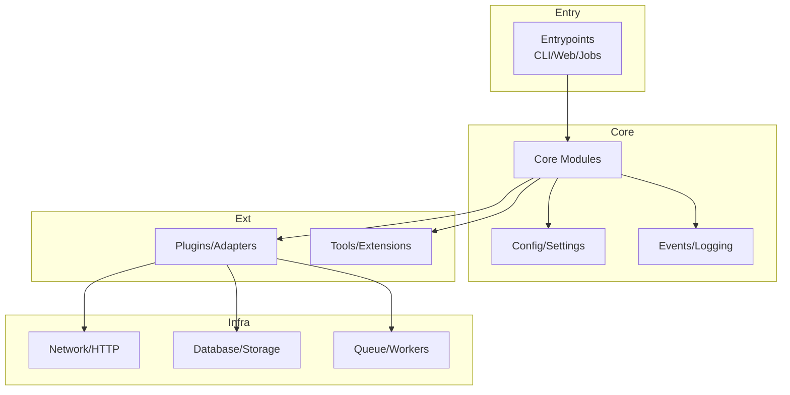
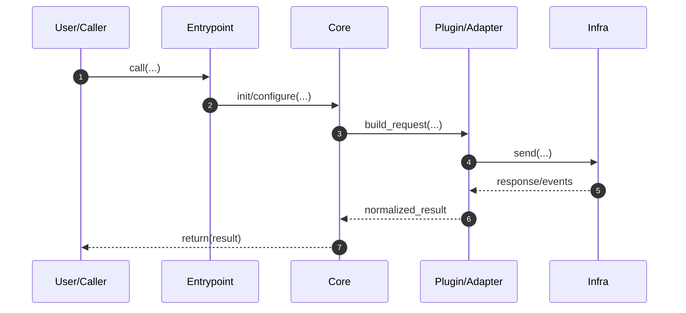

# Mermaid 模板（按需复制）

## A) 模块依赖图（graph TD）

```mermaid
graph TD
  subgraph Entry
    ENTRY[Entrypoints\nCLI/Web/Jobs]
  end

  subgraph Core
    CORE[Core Modules]
    CFG[Config/Settings]
    EVT[Events/Logging]
  end

  subgraph Ext
    PLUG[Plugins/Adapters]
    TOOLS[Tools/Extensions]
  end

  subgraph Infra
    NET[Network/HTTP]
    DB[Database/Storage]
    MQ[Queue/Workers]
  end

  ENTRY --> CORE
  CORE --> CFG
  CORE --> EVT
  CORE --> PLUG
  CORE --> TOOLS
  PLUG --> NET
  PLUG --> DB
  PLUG --> MQ
```

## B) 执行时序图（sequenceDiagram）

```mermaid
sequenceDiagram
  autonumber
  participant U as User/Caller
  participant E as Entrypoint
  participant C as Core
  participant P as Plugin/Adapter
  participant I as Infra

  U->>E: call(...)
  E->>C: init/configure(...)
  C->>P: build_request(...)
  P->>I: send(...)
  I-->>P: response/events
  P-->>C: normalized_result
  C-->>U: return(result)
```

